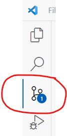

# Jul23_bds_champignons

# Arborescence

Jul23_bds_champignons

**+ data** *(Pour comprendre l'utilité de chaque csv, se référer à ../notebooks/'creation datasets')*
        - especes_classification.csv
        - especes_key.csv
        - img_supp.csv *Liste des images supprimées du jeu de données d'origine*
        - infos_images.csv
        - top10.csv *# CSV utilisé pour l'entainement des modèles (label + lien vers les img)*
        - observations_mushroom.csv *(Ignoré cause poids >100MO)
    

**+ img** *(contient des images utilisées sur le repository)*

**+ knowledge_base**
    - E02 - Entrainement et callbacks *# Notebook base de connaissances contenant des callbacks et leurs arguments*

  
**+ model** *(Modèles entrainés et enregistrés*)
    - gpot_v01_echantillon *entrainement 1er modèle sur echantillon (10%) de données*
    - gpot_v01_full        *entrainement 1er modèle sur set complet de données*
    - gpot_v01_full_tri    *entrainement 1er modèle sur set de données triées (suppression des images poubelles)*
    
    - gpot_v02_ech_tri     *entrainement 2nd modèle sur echantillon (10%) de données triées (suppression des images poubelles)

    - *A venir :*
    - gpot_v02_full_tri     *entrainement 2nd modèle sur set complet de données triées (suppression des images poubelles)

**+ notebooks**
    - 1_creation_datasets.ipynb *# Sert à construire les .csv à partir de observations_mushroom.csv*
    - 2_analyses.ipynb          *# Sert à réaliser les analyses des jeux de données et des images*
    - 3_CNN.ipynb               *# Entrainer un CNN à partir du jeu de données*
    - 4_etude_CNN               *# Charger un modèle entrainé et mener une étude sur le modèle
    - 5_optuna                  *# Entrainer un CNN avec optimisation des paramètres avec la librairie optuna (notebook en projet)

**+ streamlit_app**
    - .gitignore
    - app.py
    - README.md
    - requirements.txt*

# Clonage du repository

1- Commencer par cloner la repository localement  
Cette opération n'est à faire qu'**une seule fois** lorsque vous n'avez jamais récupéré sur votre PC (ou autre) le projet de Github.

- Aller sur la page https://github.com/DataScientest-Studio/Jul23_bds_champignons  
- Clicker sur le bouton  

- Copier l'url  

- Ouvrir un invite de commande powershell  
- Executer les commandes suivantes (à adapter selon votre besoin)  
Le plus important est la commande **git clone**
 

Par la suite vous devrez faire un "git pull" pour mettre à jour votre projet avec les nouveautés que vos collaborateurs ont poussé sur Github.

## La suite de ce tutoriel est écrit pour VSCode.  
- L'usage de Git dans VsCode est simple.  
- L'usage de Git en lignes de commandes est plus complexe et constitue une source d'erreur pour les utilisateurs avec peu d'expérience.

De plus vous serez très certainement amenés à l'avenir à utiliser VsCode pour vos projets.

Donc si vous travaillez avec un autre environnement comme Anaconda, il suffit de sauvegarder les fichiers dans le dossier local du projet Github puis de pousser l'ensemble vers Github avec VsCode ou des commandes git.

### 2- [Télécharger et Installer VsCode](https://code.visualstudio.com/download)  

### 3- Créer votre branche de travail  
Recommandation: mettre son alias dans le nom de la branche afin qu'on sache à qui elle appartient:

Par défaut vous êtes dans la branche "main".  
- Cliquer sur la branche main  
  
Le menu de commande s'ouvre en haut de VsCode:  
  
- Cliquer sur **Create new branch...**  
- Saisir le nom de la nouvelle branche. Exemple "Jacky_myFirstNotebook".  
Désormais vous êtes dans votre branche de travail qui est a été clonée à partir de la branche "main".
Vous pouvez commencer à travailler et faire vos changements.  
Cette opération est l'équivalant de la commande  
`git branch Jacky_myFirstNotebook`  

Dans quelle branche suis-je ? 
C'est visible en bas à gauche de VSCode. 
  

### 4- Sauvegarder tous vos fichiers 
Lorsque vous avez fait une mise à jour, sauvegardez vos fichiers dans le dossier local du projet Github.  
Vous devez voir les changement si vous cliquez sur l'icone git.   
  

### 5- Faire un commit qui va inclure vos changements.  
Remarque: vous pouvez faire plusieurs changements, plusieurs commits, l'important étant que la dernière opération doit être un commit avant de pousser votre branche dans GitHub.  
Dans l'exemple ci-dessous, le fichier README.md a été mis à jour.  
Maintenant il faut faire un commit avec un petit commentaire.  
**A quoi sert le commit ?** C'est un regroupement de changements faits par un developpeur dans le cadre d'une évolution (nouvelle fonctionnalité, bug fixé,...).  
Les personnes qui vont revoir le code peuvent facilement vérifier l'ensemble des changements. Les commits sont historisés afin de pouvoir tracer l'historique des changements dans le projet.  
**Recommandations:**
- ne pas faire un commit toutes les 2 minutes.
- Ne pas faire un unique commit par semaine.  
- Faire un commit lorsque vous avez fait un changement et qu'il est testé.  

- **Saisir un court message** résumant en quoi consiste le changement
- Vérifier la liste des fichiers que vous venez de modifier (optionel).
- Cliquer sur le bouton **Commit**  

Cette opération est équivalante à la commande `git commit -M "mon changement"`

### 6- Poussez votre branche vers Github
Cliquer sur **Sync Changes**  

  
Cete opération est equivalente à la commande `git push`.

### 7- Vérifier sur Github (optionel)
- Afficher la liste des branches
- Sélectionnez votre branche  
  
- Accédez à vos fichiers

### 8- En cours de développement, vous pouvez vérifier le status de votre branche:  
Ici  
  
Le chiffre indique le nombre de changements en attente de commit.  
Et ici  
  
- L'étoile signifie qu'il y a des changements non commités
- Le premier chiffre signifie qu'il y a des mises à jour dans Github qui n'ont pas été récupérées localement. Votre branche locale est en retard sur Github.
- Le seoncd chiffre signifie que votre branche local possède des commits non encore répliquées vers Github. Votre branche est en avance sur Github. Vous devrez pousser vers GitHub.
